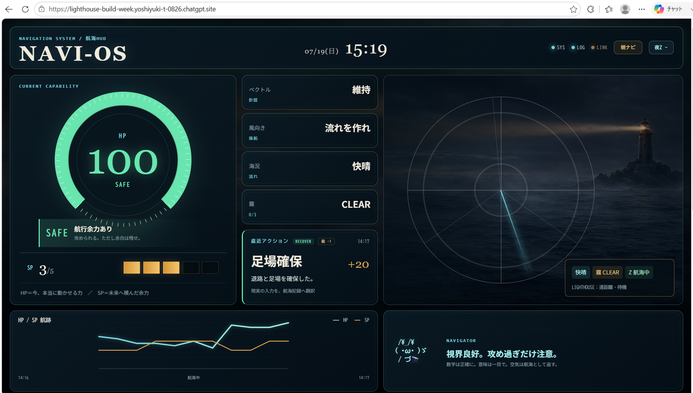
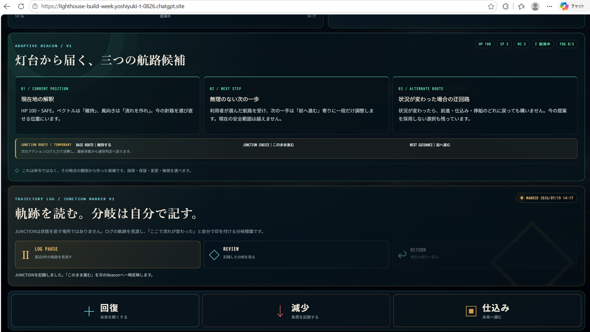
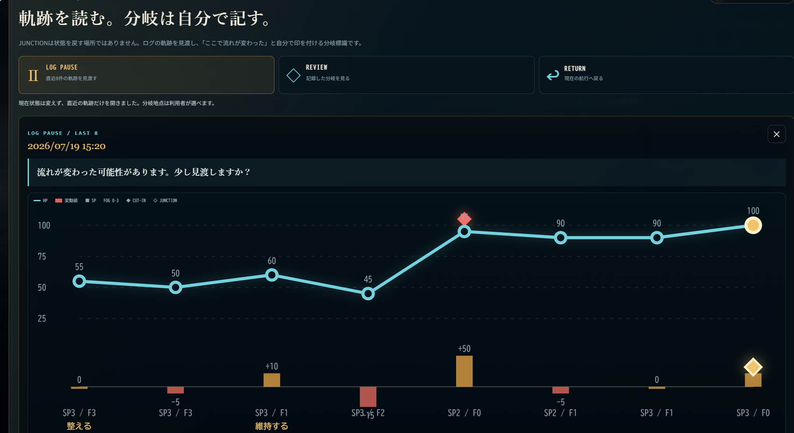
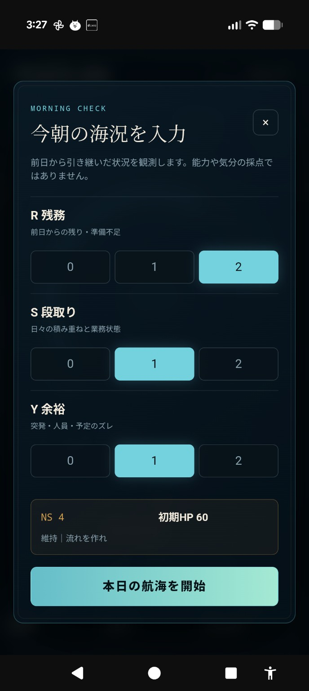
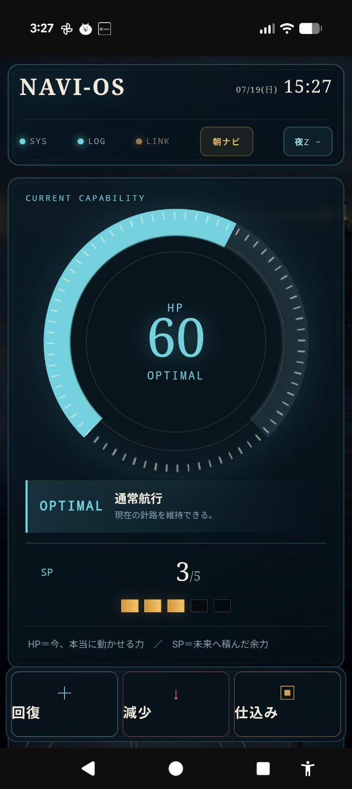
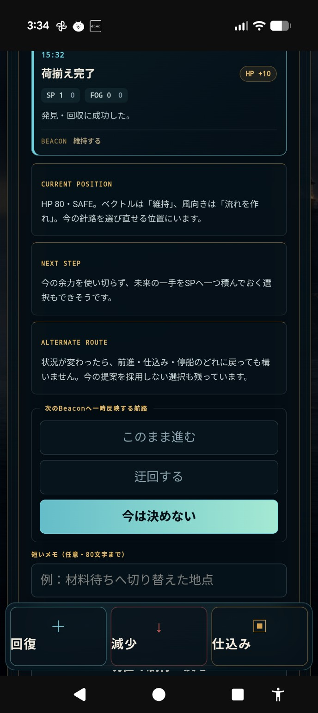

# Lighthouse — Build Week Edition

> **A navigation system that grows with its operator.**

Lighthouse is a responsive personal navigation HUD for moments when unfinished work, preparation gaps, unexpected events, and limited capacity make the next decision difficult.

It does not manage people, continuously interrupt them, or prescribe one correct answer. It reflects the operator’s current state, preserves the trajectory of recent actions, and illuminates possible next routes while leaving the final decision to the person.

**Live demo:** https://lighthouse-build-week.yoshiyuki-t-0826.chatgpt.site  
**Demo video:** https://youtu.be/BaHCZXbj8D0  
**Source repository:** https://github.com/yoshiyukit0826-creator/lighthouse-build-week-edition  
**Japanese reference:** [README.ja.md](README.ja.md)

---

## The Core Idea

Lighthouse is not an autonomous agent waiting to take control.

A lighthouse does not steer the ship. It stays quiet during ordinary navigation and becomes useful when the operator needs to recover orientation, inspect the route already taken, or find another way forward.

That is why Lighthouse is intentionally calm:

- it does not demand constant attention;
- it records actions without turning every action into a notification;
- it allows the operator to open the trajectory when reflection becomes useful;
- it illuminates multiple routes rather than issuing a command;
- it leaves meaning, timing, and final judgment with the human.

**The absence of a runtime LLM call is not the absence of AI contribution.** The public HUD is the executable result of a longer human–AI co-design process, made deterministic so judges can reproduce its behavior safely without private workplace data, credentials, or API keys.

---

## How Lighthouse Evolved with GPT

Lighthouse did not begin as a one-week prompt-to-app exercise.

Its operational foundation began before Build Week as a Google Sheets navigation system developed through repeated field use and collaboration with earlier GPT model generations. The operator brought real operational language, constraints, mistakes, recovery behavior, and daily observations. The AI collaboration helped turn those observations into reusable concepts such as R/S/Y, NS, HP, SP, time decay, operating bands, and action logs.

During Build Week, **GPT-5.6 — called ARK in this project — became the co-designer that helped move the system into its next generation**. GPT-5.6 was used to compare the pre-existing system with real-world evidence, preserve continuity across many design decisions, challenge contradictions, and consolidate previously separate ideas into one public navigation model:

- **Adaptive Beacon** — multiple possible routes instead of one prescribed answer;
- **Trajectory Review** — recent actions become a visible route rather than a passive log;
- **LOG PAUSE / LAST 8** — pause the visual flow to reflect without stopping or rewriting recording;
- **JUNCTION** — mark a meaningful turning point and choose Continue, Detour, or Decide Later;
- **responsive Web HUD** — translate a private Sheets workflow into a reproducible desktop/mobile experience.

This is the central evidence of GPT-5.6 use: it was not added as a decorative runtime API badge. It served as the reasoning, continuity, and translation layer that enabled an operating system built with earlier GPT generations to become the Build Week Lighthouse experience.

Codex then audited the exported source, checked integrity and secret handling, installed dependencies, ran lint, tests, and the production build, initialized Git, committed the verified package, and published it to GitHub.

---

## Screenshots

### Desktop overview



### Adaptive Beacon and JUNCTION



### Trajectory Review



### Mobile experience

<p align="center">
  
  
  
</p>

---

## Why Lighthouse Exists

When pressure rises, people often try to hold everything in their head at once:

- What work is still unfinished?
- What preparation has already been completed?
- What might change unexpectedly?
- How much capacity is actually left?
- Should I continue, detour, or wait before deciding?

That makes the next decision more emotional and less observable.

Lighthouse creates a shared visual language for current capacity, future reserve, operational weather, and trajectory. Its purpose is not to replace judgment. Its purpose is to restore visibility before judgment is made.

---

## Core Navigation Model

### Morning Check: R / S / Y

The operator begins the day by entering three observations:

- **R — Remaining work:** unfinished work, carryover, or missing preparation
- **S — Setup:** the strength of current preparation and accumulated readiness
- **Y — Yield margin:** available room for unexpected events, staffing changes, delays, or variation

These values form the initial navigation state for the day.

### NS — Initial Navigation State

NS is the combined morning state derived from R, S, and Y. It determines the initial operating band and starting HP.

### HP — Current Operating Capacity

HP represents the operator’s current ability to continue operating effectively. It is not a medical measurement.

```text
Current HP =
clamp(
  Initial HP
  + Recovery
  - Decrease
  - Time Decay,
  0,
  100
)
```

Time decay is counted only during active work periods. Breaks and weekends are excluded.

HP is translated into visible operating bands such as SAFE, OPTIMAL, CAUTION, DANGER, and CRITICAL.

### SP — Future Reserve

SP represents value created through preparation.

It is not displayed as extra HP. HP is current capacity; SP is a future reserve that can be stored and deliberately released when needed.

### Weather, Fog, and Visibility

Lighthouse translates operational conditions into navigation language: weather, wind, fog, route visibility, and beacon strength.

These are not decorative metaphors. They are a visual translation of the operator’s current environment and recent trajectory.

---

## How It Works

1. **Morning Check** establishes the initial state from R, S, and Y.
2. **Recovery, Decrease, and Preparation actions** update HP and SP during the day.
3. The HUD translates those changes into rings, state bands, weather, navigator messages, cut-ins, and trajectory.
4. **Adaptive Beacon** presents multiple possible next routes instead of issuing one command.
5. **Trajectory Review** allows the operator to pause the visual flow and inspect the latest eight events.
6. **JUNCTION** allows the operator to mark a turning point and choose:
   - Continue
   - Detour
   - Decide later
7. The selected JUNCTION choice temporarily informs the next Beacon guidance.

Past HP, SP, R/S/Y values, and logs are never restored or rewritten by a JUNCTION choice.

---

## Evidence from Real-World Use

Lighthouse evolved from a navigation system used by one operator in daily field operations beginning in March 2026.

A retrospective analysis of the pre-existing Google Sheets action log covered **8 March through 26 May 2026**, including **57 active logging days** and **1,105 valid non-zero HP events**.

| Metric | March | April | May |
|---|---:|---:|---:|
| Negative events per active logging day | 10.78 | 5.50 | 2.71 |
| Negative HP points per active logging day | 121.30 | 58.00 | 33.93 |
| Recovery events per active logging day | 15.43 | 10.50 | 10.29 |
| Low-load days (0–2 negative events) | 8.7% | 25.0% | 64.3% |
| High-load days (5+ negative events) | 87.0% | 60.0% | 21.4% |


From March to May, **recorded negative operational events per active logging day decreased by 74.8%**. The more conservative April-to-May comparison still shows a **50.6% decrease**, while recovery-event logging remained essentially stable at **10.5 to 10.3 events per active day**.

This is **not** presented as a causal productivity claim. The dataset covers one operator and is not connected here to production volume, cycle time, overtime, or defect data. It is narrower longitudinal evidence that recorded operational friction decreased while recovery behavior continued to be observed.

Full methodology, caveats, event-level trends, and anonymized aggregates:

- [`docs/REAL_WORLD_EVIDENCE.md`](docs/REAL_WORLD_EVIDENCE.md)
- [`docs/data/real-world-log-summary.csv`](docs/data/real-world-log-summary.csv)

---

## Key Features

### Adaptive Beacon

Adaptive Beacon presents route candidates when the operator’s view has narrowed. Its role is to make alternatives visible, not to choose on the operator’s behalf.

### NAVIGATOR AA

The navigator message is positioned near the top of the HUD so the current interpretation is visible before the operator reaches the action controls.

### Fixed Action Controls

The action board remains available on desktop and mobile, allowing the operator to record recovery, decrease, and preparation without leaving the main navigation view.

### Ring Feedback and CUT-IN

HP changes are translated into immediate visual feedback. Important events can appear as CUT-IN moments so meaningful changes are not lost inside a passive log.

CUT-IN is event-driven, not a constant notification stream. The operator can otherwise leave Lighthouse quietly in the background.

### Trajectory Review

`LOG PAUSE` does not stop recording. It temporarily pauses the visual flow and opens `LAST 8`, allowing the operator to inspect the most recent trajectory without rewriting the past.

### JUNCTION

The operator selects a meaningful turning point from recent history and records a route choice.

JUNCTION preserves human authority: the system can illuminate routes, but the person decides whether to continue, detour, or postpone the decision.

### Responsive Web HUD

The Build Week edition is designed for desktop and smartphone browsers. It is a Web HUD, not a native Wear OS application.

---

## Existing Foundation vs. Build Week Work

| Area | Existing before Build Week | Added or evolved during Build Week |
|---|---|---|
| Morning state | R/S/Y input, NS, and initial HP | Responsive Morning Check interface |
| Action input | Smartphone and Pixel Watch input through HTTP Shortcuts | Fixed action controls inside the Web HUD |
| Data path | HTTP Shortcuts → Google Apps Script → Google Sheets action log | Standalone public Web HUD for reproducible judging |
| HP | Recovery, decrease, time decay, status bands | HP ring, effects, recent input, and responsive state presentation |
| SP | Preparation reserve and controlled release | Dedicated SP stock and use presentation |
| Navigation | State bands and navigator wording | Adaptive Beacon with multiple route candidates |
| Trajectory | Action log and HP graph | Trajectory Review, LOG PAUSE, LAST 8, CUT-IN and JUNCTION markers |
| Turning points | Not present | JUNCTION choice and temporary reflection into the next guidance |
| Interface | Google Sheets HUD | Public desktop/mobile Lighthouse Web HUD |
| AI collaboration | Earlier GPT generations helped formalize the operational model | GPT-5.6 consolidated the accumulated model into the Build Week navigation experience |

The public Build Week site is not connected to the Google Sheets backend in real time. It uses a controlled standalone state so judges can reproduce the interaction reliably. Real-time operational time decay is therefore paused in the public demo.

---

## Why the Public Demo Is Deterministic

A real-time GPT-5.6 API call was deliberately not made a dependency of the public judging path.

This choice provides four benefits:

1. **Reproducibility:** every judge can observe the same state transitions.
2. **Privacy:** no private workplace logs, credentials, or personal context leave the operational system.
3. **Reliability:** the demo works without API keys, quota, network inference latency, or model-output variance.
4. **Human authority:** the navigation model remains a quiet decision-support layer rather than an autonomous manager.

A future connected version may use an LLM to personalize language or interpret additional context. The Build Week edition demonstrates the core navigation interaction itself: reflection, reserve, trajectory, and human-controlled route selection.

---

## Technical Architecture

### Pre-existing operational system

```text
Smartphone / Pixel Watch
        ↓
HTTP Shortcuts
        ↓
Google Apps Script
        ↓
Google Sheets Action Log
        ↓
R/S/Y, NS, HP, SP, Time-Decay Calculations
        ↓
Sheets HUD and Charts
```

### Build Week submission

```text
Operator
   ↓
Responsive Lighthouse Web HUD
   ├─ Morning Check
   ├─ HP / SP actions
   ├─ Adaptive Beacon
   ├─ NAVIGATOR AA
   ├─ CUT-IN feedback
   ├─ Trajectory Review
   └─ JUNCTION choice
```

The Build Week edition transforms the existing operating logic into a standalone public experience for desktop and mobile browsers.

---

## Run Locally

### Requirements

- Node.js `22.13.0` or newer
- npm

### Install and start

```bash
npm ci
npm run dev
```

Open the local URL printed by Vite in your browser.

The standalone public-demo state does not require API keys or private Google Sheets credentials.

### Verify the repository

```bash
npm run lint
npm test
npm run validate:artifact
```

`npm test` performs the verified production build and runs the rendered-interface test suite.

---

## Try the Demo

1. Open the public Web HUD.
2. Complete the Morning Check.
3. Try Recovery, Decrease, and Preparation actions.
4. Observe HP, SP, ring feedback, weather, and navigator responses.
5. Open `LOG PAUSE / LAST 8`.
6. Review the recent trajectory.
7. Mark a JUNCTION.
8. Choose Continue, Detour, or Decide Later.
9. Observe how the next Beacon guidance reflects that route choice.

No login is required.

---

## Design Principles

1. **Reflect before directing.**
2. **Present routes instead of forcing one answer.**
3. **Preserve the past instead of rewriting it.**
4. **Keep the final decision with the operator.**
5. **Stay quiet until orientation is useful.**
6. **Grow through repeated human–AI observation.**

---

## Limitations

- The public Web HUD does not synchronize with the Google Sheets backend in real time.
- It uses a controlled standalone state for reproducible judging.
- It is not a medical, safety-critical, or autonomous decision system.
- It does not claim to calculate a universally optimal route.
- The real-world evidence covers one operator and does not establish causality.
- Productivity output has not yet been quantified against production volume, cycle time, overtime, or defect data.
- Pixel Watch operation belongs to the pre-existing HTTP Shortcuts workflow; the public submission is a browser-based Web HUD.
- Future work will explore how the model can adapt to another operator without erasing individual context.

---

## Build Provenance

The primary Build Week Web HUD was created and iterated in ChatGPT Sites.

- **Site ID:** `appgprj_6a5c143957bc81918fdd6ff56138d827`
- **Site slug:** `lighthouse-build-week`
- **Published version:** `13`
- **Saved version ID:** `appgprj_6a5c143957bc81918fdd6ff56138d827~appgver_a5e63da282c8819188425d55ec32aea2`
- **Checkpoint:** `Mobile Action Focus Final v1`
- **Source commit SHA:** `26c61af276f6ddedcd80f78516cb9fb63e8eeebb`
- **Deployment ID:** `appgdep_6a5ccb2ec5448191be89c4fdd6b3c9bf`
- **Deployment status:** `succeeded`

The original Web HUD was created and iterated in ChatGPT Sites. Codex did not build the majority of that original Sites UI. The Codex publication thread was used to audit the exported source, verify integrity and secret handling, install dependencies, run lint, tests, and the production build, initialize Git, commit the verified package, and publish it to GitHub.

### Verified Codex publication evidence

- **Codex Session ID:** `019f7db6-7ced-7e60-b16f-2628031b0ef7`
- **Final publication commit SHA:** `33afd0ea912c41bb5f87aa4e50a8a1c242c5b08d`
- **Committed files at publication checkpoint:** `61`
- **Lint:** passed
- **Tests:** 8 passed, 0 failed
- **Production build:** passed
- **Secret scan:** passed

---

## Repository Contents

```text
app/                              Lighthouse Web HUD application
public/                           Lighthouse and CUT-IN image assets
worker/                           Sites/Cloudflare worker entry point
build/                            Sites build integration
scripts/                          Install, build, and artifact validation scripts
tests/                            Rendered-interface behavior tests
assets/screenshots/               Desktop and mobile evidence images
assets/evidence/                  Aggregate real-world evidence chart
docs/REAL_WORLD_EVIDENCE.md       Methodology and longitudinal findings
docs/data/                        Anonymized aggregate evidence data
docs/DEVPOST_IMPACT_UPDATE.md     Paste-ready impact language
docs/DEVPOST_FINAL_COPY.md        Paste-ready final submission language
docs/ARCHITECTURE.md              Existing and Build Week architecture
docs/BUILD_WEEK_SCOPE.md          Existing foundation vs. new work
docs/TESTING_GUIDE.md             Judge testing path
docs/PROVENANCE.md                Site/version/deployment evidence
docs/CODEX_AND_GPT56.md           Transparent collaboration record
docs/VALIDATION.md                Clean-package verification result
docs/SOURCE_EXPORT.md             Export and sanitization record
BUILD_WEEK_CHANGELOG.md           Checkpoint-by-checkpoint Build Week record
README.md                         English project README
README.ja.md                      Japanese reference translation
LICENSE                           MIT License
```

Raw workplace logs, private spreadsheet contents, credentials, generated caches, dependency directories, and exported font binaries are intentionally excluded.

---

## Closing Thought

Lighthouse began as a practical way to make daily operational capacity visible.

During Build Week, it became something broader:

A system that does not tell a person what to do, but helps them recover their view of the sea.

**It does not manage people. It reflects where they are and illuminates the next step and another route.**