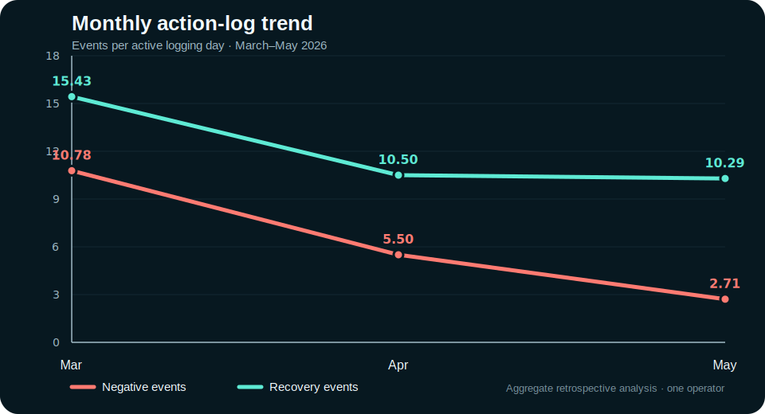

# Evidence from Real-World Use

Lighthouse grew from a navigation system used by one operator in daily field operations before Build Week.

This document summarizes an aggregate retrospective analysis of the pre-existing Google Sheets action log. The raw operational log is not published because it contains workplace context. Only anonymized monthly aggregates are included.

## Analysis window

- **Period:** 8 March 2026 through 26 May 2026
- **Active logging days:** 57
- **Valid HP events:** 1,105
- **Source rule:** rows where `Phenomenon = HP` and `Change != 0`
- **Negative event:** `Change < 0`
- **Recovery event:** `Change > 0`
- **Active logging day:** any date containing at least one recorded action-log row

No individual rows were removed ad hoc. March includes early-adoption and setup behavior, so both the full March-to-May trend and the more conservative April-to-May comparison are reported.

## Main result

| Metric | March | April | May |
|---|---:|---:|---:|
| Active logging days | 23 | 20 | 14 |
| Negative events per active day | 10.78 | 5.50 | 2.71 |
| Negative HP points per active day | 121.30 | 58.00 | 33.93 |
| Recovery events per active day | 15.43 | 10.50 | 10.29 |
| Negative share of valid HP events | 41.1% | 34.4% | 20.9% |
| Low-load days (0–2 negative events) | 8.7% | 25.0% | 64.3% |
| High-load days (5+ negative events) | 87.0% | 60.0% | 21.4% |

From March to May:

- recorded negative events per active logging day decreased by **74.8%**;
- recorded negative HP points per active logging day decreased by **72.0%**;
- the share of low-load days increased from **8.7% to 64.3%**;
- the share of high-load days decreased from **87.0% to 21.4%**.

The more conservative April-to-May comparison still shows:

- negative events per active logging day decreased by **50.6%**;
- negative HP points per active logging day decreased by **41.5%**;
- recovery-event logging remained essentially stable at **10.5 to 10.3 events per active day**.

## Event-level trend

Per active logging day, March-to-May decreases were:

| Recorded negative event | March | May | Change |
|---|---:|---:|---:|
| Mistake | 1.09 | 0.07 | −93.4% |
| Miscellaneous interruption | 3.91 | 0.79 | −79.9% |
| Searching / finding items | 3.13 | 0.64 | −79.5% |
| Setup breakdown | 1.70 | 0.93 | −45.2% |
| Material issue / return | 0.96 | 0.29 | −70.1% |

## Interpretation

These figures do **not** establish a causal productivity increase. The analysis covers one operator, uses self-recorded operational events, and does not yet connect the log to production volume, cycle time, overtime, or defect data.

What the log does support is narrower and directly aligned with Lighthouse:

> Recorded operational friction decreased over time while recovery behavior continued to be logged.

The pattern is consistent with fewer repeated disruptions, fewer search and mistake events, and more days that remained within a low-load operating range.

This is longitudinal evidence for the project’s central idea:

> **A navigation system that grows with its operator.**

## Reproducibility

The aggregate table used for this document is available at:

- [`docs/data/real-world-log-summary.csv`](data/real-world-log-summary.csv)

The private source log and workplace-specific labels are intentionally excluded from the public repository.
